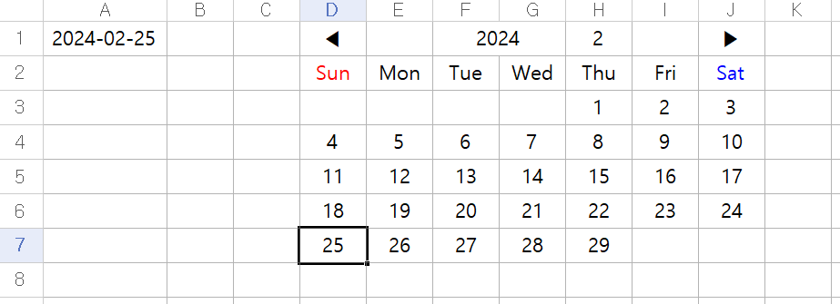

# 한셀 날짜 선택기

부대에서 쓰려고 만든 한셀 날짜 선택기

## 사용법
1. offsetRow, offsetCol 변수를 수정하여 날짜 선택기가 출력될 위치를 지정합니다.
2. outputCell 변수를 수정하여 날짜를 선택했을 때 날짜가 입력될 셀을 지정합니다.
3. printCalendar() 서브루틴을 최초 실행하여 날짜 선택기를 출력합니다.

## 기능
- 지정한 위치에 날짜 선택기 출력
- 날짜 선택시 지정한 셀에 날짜 입력
- 화살표 버튼을 눌러 이전/다음 달 변경
- 연도, 월을 직접 입력하여 

## 그 외
- 한셀 2018 테스트 완료
- 엑셀 VBA와 호환 가능

## 사진

